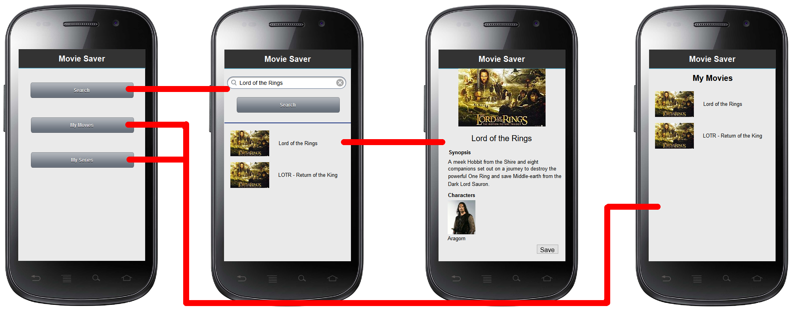

# MovieSaver app

## Goals

This app aims to help you remember all the films that you don't want to forget.

## Problem

> Write a statement about the problem that your finished project will solve. 
	The problem1 has to be clearly described and very specific. In total, keep the problem statement to four or five lines of text.
	
When you've seen a lot of movies it becomes problemetic to remember all the good ones. It's inefficiënt to just note down the
names of the movies you like, because that doesn't give you a lot of information. It's also inefficiënt to save webpages of the
movies with information. So what you need is a way to save your favourite movies, with pictures, cast, synopsis and posibly
even your own rating

## Solution

### Description and visualization

In this app you can save all your favourite movies complete with picture, cast, synopsis (and your personal rating)

### Features

Main features:
- Search for movies
- Search for future movies
- Save movies

Minimum viable product:
- Search for movies
- Search for future movies
- Save movies
- Save series (if available)
- Remove movies from saved list

Optional part:
- Rate saved movies
- Sort saved movies
- Save favourite actors
- Set alarm for release of future movie
- Include a trailer

## Prerequisites
### Data Source

The data of the movies is acquired through the Rotten Tomatoes API. Information can be found at the 
[Any API](https://any-api.com/rottentomatoes_com/rottentomatoes_com/docs/Search/MoviesSearchSearch/) website. The data for
the future movies can also be found on the 
[Any API](https://any-api.com/rottentomatoes_com/rottentomatoes_com/docs/Movie_Lists/UpcomingMoviesMovieLists/) website.

### External components

I might have to use SQLite or something like that, since SharedPreferences might not be enough to save all the data.

### Review of similar apps/vizualizations

Rotten Tomatoes (website): The website of RT is the origin of the API that I will use. You can search for movies, series, 
top movie, lists and actors. All items can be rated by both critics and normal people, so it gives you an overview of how the
critis rate is versus how the average person rates it. You are able to add things to your "To Watch" list or your "Not 
Interested" list. You can't log in on the website on your phone though, so the lists are unusable, and they don't have an app.

Filmy (app): This app let's you search for movies and series and gives you information on them. They also show popular and 
upcoming films. Unfortunately you get an ad each time you click something, whidh is really annoying and is something why I would
never use it.

### Hardest parts

I think the hardest part is going to be to get the API to work properly. And also to only get the information that I want to
save and pass it through.

